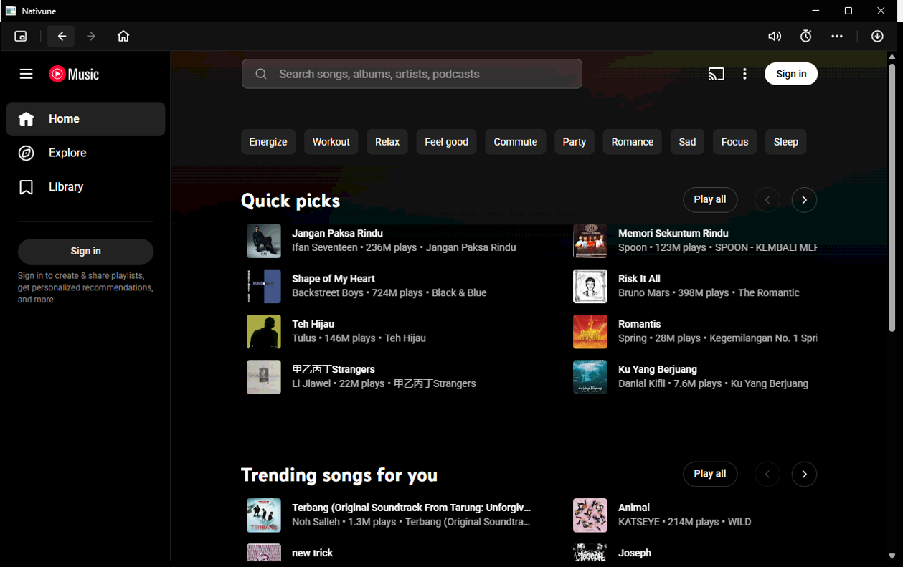
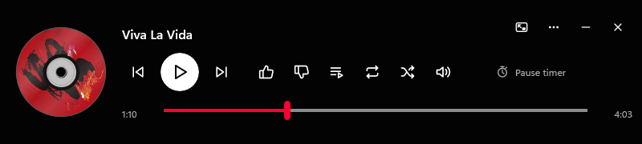

# Nativune

Nativune is an unofficial, native Windows desktop app for YouTube Music, built with C# and WinUI 3. It embeds the official YouTube Music website in an isolated Microsoft Edge WebView2 view and adds native desktop controls such as a Compact mini player, tray and taskbar buttons, and a pause timer.

Nativune is for Windows users who want YouTube Music in its own desktop window with native controls, rather than in a browser tab or an Electron-based client. It uses the shared WebView2 runtime that Windows already provides instead of bundling its own copy of Chromium. It does not block ads, download media or use a private playback API.





## Notice

Nativune is an unofficial project. It is not affiliated with, endorsed by or sponsored by Google or YouTube. It displays the official YouTube Music website, and playback, ads and account features remain governed by that website and its terms.

YouTube and YouTube Music are trademarks of Google LLC.

## Project at a glance

| | |
| --- | --- |
| Category | Desktop client for YouTube Music (native shell around the official website) |
| Platform | 64-bit Windows 10, version 2004 (build 19041) or later, including Windows 11 |
| Language and UI | C# on .NET 10, WinUI 3 (Windows App SDK 2.5.1) |
| Web engine | Microsoft Edge WebView2, shared Evergreen Runtime |
| License | [MIT](LICENSE) |
| Latest release | [v0.1.12](https://github.com/Hantu-Raya/Nativune/releases/tag/v0.1.12) at the time of writing (unsigned installer); see [all releases](https://github.com/Hantu-Raya/Nativune/releases) |
| Status | Early and experimental; see [Known limitations](#known-limitations) |

## Why Nativune exists

Google does not offer a native Windows app for YouTube Music, and its public developer APIs do not provide YouTube Music playback. The usual options are a browser tab, an installed web app (PWA), or a third-party Electron client. Electron clients ship their own Chromium runtime, and some add plugins that change the website, such as ad blocking or downloads.

Nativune takes a narrower approach. It puts the official website in a native Windows window, changed only by privacy-list tracker filtering, and uses the WebView2 runtime that Windows already provides. The native features it adds are controls around that website, such as a mini player, tray icon, taskbar buttons and a timer. It does not change what the website plays.

## Features

- **Full and Compact views in one window.** The Compact view is a native horizontal mini player, 800 × 180 by default, with a fixed height and adjustable width. It has artwork, title, elapsed time and duration, a seek bar, previous/play/next, like/dislike, repeat, shuffle, volume and a pause timer.
- **Native toolbar** in the full view, in two groups: Compact toggle, back, forward and Home on the left; app volume, pause timer, More (`…`) and the update indicator on the right. Previous, play/pause and next live in More, next to the website's own player bar.
- **Taskbar thumbnail buttons** for previous, play/pause and next.
- **Optional tray icon.** It is on by default for new profiles. While it is enabled, Close hides the window and playback keeps running. Quit always exits.
- **Pause timer** from one second to four hours. When it expires, playback pauses and the window stays open.
- **App volume and mute**, which control only Nativune's own audio, not the system volume or the website's slider.
- **Keyboard shortcuts you can customize.** They only work after you enable them for the current session from the menu.
- **Window options:** keep on top, fullscreen, page zoom, start in Compact, and reopen on the last Home or Library section.
- **Reduce motion** setting that stops the rotating artwork and scrolling titles in Compact.
- **Privacy-only uBlock Origin Lite.** Only the EasyPrivacy tracker list is enabled, and only on `music.youtube.com`. No ad-blocking lists are enabled.
- **Per-user installer** with SHA-256 checksums. It does not need administrator rights to install Nativune itself.
- **Update indicator** that checks GitHub Releases and never downloads or installs anything without a click.

## How it works

Nativune has three parts:

1. **App host (`Nativune.exe`).** A WinUI 3 window that owns exactly one WebView2 control and draws the native toolbar, Compact player, dialogs, tray icon and taskbar buttons.
2. **Embedded website.** The WebView2 control loads `https://music.youtube.com/` from an isolated browser profile stored in the installation's `data/` directory. You sign in on Google's own pages inside this view. Nativune never handles your password.
3. **Control dispatcher.** Native buttons act by operating the website's own visible controls in that single owned view. For example, Compact seeking drives Music's own progress slider. Each command checks the page origin and the target control first. If a check fails, the command does nothing and reports why. Commands are never retried and never sent to another player.

Because controls go through the public website interface, they can stop working when YouTube Music changes its page. This is not a documented Google API.

The installer (`Nativune-Setup.exe`) is a self-contained .NET program. It installs per user, checks for the shared runtimes listed under [Requirements](#requirements), and asks before installing any that are missing. Release installers are built by this repository's GitHub Actions workflow.

## Security and privacy model

- **Navigation allow-list.** The main view may only open HTTPS pages on YouTube Music and Google account sign-in hosts. Other navigations and new windows are blocked.
- **Blocked by default:** file downloads, website permission requests (camera, microphone, location and others) and launches of external URI schemes.
- **No native bridge.** WebView2 host objects and web messaging are disabled, so page scripts cannot call into the native app.
- **Isolated profile.** Cookies and site data stay in Nativune's own WebView2 profile. Nativune does not import cookies from other browsers and does not collect passwords.
- **Tracker filtering only.** uBlock Origin Lite runs with EasyPrivacy on `music.youtube.com` and filtering is off for other sites. Ads are not blocked.
- **Updates.** Each check is one anonymous request to the GitHub Releases API for this repository. Opening the update dialog makes one more anonymous request, for the release notes. Updates are offered only for newer stable releases. The download is checked against its published SHA-256 digest before Setup starts.

## Performance

Nativune applies these resource settings by default:

- WebView2 memory usage target set to **Low**, and pages drop their caches while the website is hidden (Compact, minimized or in the tray)
- Windows **EcoQoS** power throttling and Idle priority for the app host, browser and GPU processes. Page renderers are left to Chromium's own priority management, and the audio, network and storage services run at normal priority so playback isn't starved.
- Chromium options that limit renderer processes to two, lower GPU power use, and cap the disk and graphics caches
- **Sleep in background** (on by default), which lets Chromium throttle timers and rendering while the window is minimized, hidden or covered

**Maintainer-observed memory (informal).** Numbers from Windows Task Manager with v0.1.10, counting the Nativune process group including its WebView2 child processes:

| State | Approximate memory |
| --- | --- |
| Idle (app open, no music playing) | ~60 MB |
| Typical use | ~250 MB |
| Peak observed | under ~400 MB |

These are informal observations on one machine, not a controlled benchmark. Memory varies with hardware, account, page content and session length. A repeatable measurement of the complete process tree is on the [roadmap](ROADMAP.md).

**Download size.** The v0.1.10 `Nativune-Setup.exe` is about 177 MB (177,072,567 bytes). This excludes the shared runtimes it relies on (the WebView2 Runtime, .NET 10 and Windows App SDK). Those are installed once per machine and shared with other apps.

## Comparison with other approaches

This compares architecture, not measured performance.

| | Nativune | Electron-based desktop clients | Browser tab or installed web app (PWA) |
| --- | --- | --- | --- |
| Web engine | Shared WebView2 runtime from Windows | Chromium bundled with each app | Your browser |
| Native UI | WinUI 3 window, Compact player, tray, taskbar buttons | Varies by client | Browser window |
| Website changes | None beyond privacy-only tracker filtering | Often plugins, some with ad blocking or downloads | Your browser extensions |
| Profile | Isolated, app-only | App-only | Shared with your browser profile |
| Platforms | Windows x64 only | Often Windows, macOS and Linux | Any supported browser |

## Requirements

- 64-bit Windows 10, version 2004 (build 19041) or later, including Windows 11
- .NET 10 Runtime (not the Desktop Runtime)
- Windows App SDK 2.5.1 runtime
- Microsoft Edge WebView2 Evergreen Runtime 152.0.4191.62 or later
- x64 Visual C++ v14 Redistributable
- Internet access for YouTube Music, update checks and downloading missing prerequisites

Setup checks for missing shared prerequisites and asks before installing them. Installing shared components may need administrator rights or a change to organization policy.

## Install

1. Download `Nativune-Setup.exe` and `SHA256SUMS.txt` from the [Nativune GitHub Releases page](https://github.com/Hantu-Raya/Nativune/releases).
2. In PowerShell, calculate the installer's SHA-256 hash and display the checksum file:

   ```powershell
   Get-FileHash .\Nativune-Setup.exe -Algorithm SHA256
   Get-Content .\SHA256SUMS.txt
   ```

   Compare the reported hash with the `Nativune-Setup.exe` entry in `SHA256SUMS.txt`. Do not run the installer if they differ.
3. Run `Nativune-Setup.exe` and follow Setup.

The default install location is `%LOCALAPPDATA%\Nativune`. Setup adds Start menu and desktop shortcuts. In-place upgrades keep the existing `data/` directory.

### Unsigned-build warning

The installer is not yet Authenticode-signed, so Windows may show an "Unknown publisher" or SmartScreen warning. Signing will identify the publisher, but new releases may still trigger SmartScreen until they build reputation.

## Usage

1. Open **Nativune** from the Start menu.
2. Select **Sign in** on the YouTube Music page and complete Google sign-in in the embedded view. You can also use it signed out.
3. Play music as you would on the website. The website's player bar, the taskbar buttons, the More menu and the Compact player all control the same player.
4. Select the **Compact window** button at the left of the toolbar to switch to the mini player, and **Return to full** to switch back.
5. Open **More commands and settings** (`…`) for playback commands, tray, keep-on-top, zoom, fullscreen, the pause timer, session shortcuts and **Settings**.

## Updates

The app never opens an update dialog on its own and never downloads an update without a click. In the full-window top toolbar, the button at the far right shows:

- `update-available` (accent-tinted) when a newer stable release is available
- `update` otherwise, including before the first check and when a check fails

The button shows "Click to check for Nativune updates." until a check runs, and reports "up to date" only after a successful check. Update checks run only in installed builds. Development runs show "Update checks are available only in installed Nativune builds."

Compact mode has no update button. Click `update-available` to open the confirmation dialog. It lists what changed between your installed version and the new one, covering every release in between, newest first, in a scrollable area. Choose **Update now** to download, verify the SHA-256 digest and start Setup, or **Later** to defer. Setup asks again before upgrading. Click `update` to run a manual check. If checking fails, the tooltip reads "Couldn't check for updates. Click to try again."

When **Check for updates automatically** is enabled in Settings (the default), the app checks at startup and every 24 hours while running. Automatic checks only report availability; they never open a dialog or download anything.

## Uninstall

Uninstall Nativune from **Windows Settings > Apps > Installed apps**, or run the installed Setup program with `--uninstall`. Uninstall removes application files and shell registration but keeps `data/`. Delete the installation's `data/` directory yourself if you also want to remove the isolated WebView2 profile, its site data and your Nativune settings.

## Build from source

Prerequisites: Windows x64, PowerShell 7 (`pwsh`) and Git. The setup scripts download a pinned .NET SDK and the other development inputs into repository-local directories.

```powershell
git clone https://github.com/Hantu-Raya/Nativune.git
cd Nativune
pwsh -NoProfile -File scripts/setup.ps1
pwsh -NoProfile -File scripts/setup-webview2.ps1
pwsh -NoProfile -File scripts/setup-ubol.ps1
pwsh -NoProfile -File scripts/dotnet.ps1 restore src/Nativune/Nativune.csproj --runtime win-x64
pwsh -NoProfile -File scripts/dotnet.ps1 restore src/Nativune.Installer/Nativune.Installer.csproj --runtime win-x64
pwsh -NoProfile -File scripts/build-release.ps1 -Version 0.1.12 -Configuration Release
```

Downloaded tools, browser and extension inputs and NuGet packages stay in repository-local `.tools/` and `.cache/` directories. The release build writes `Nativune-Setup.exe`, `Nativune-Setup.zip`, `release-manifest.json` and `SHA256SUMS.txt` to `artifacts/release/`.

To run a development build without installing it:

```powershell
pwsh -NoProfile -File scripts/dotnet.ps1 publish src/Nativune/Nativune.csproj --runtime win-x64 --self-contained false -o artifacts/winui3/publish
pwsh -NoProfile -File scripts/probe.ps1 web
```

Development builds keep their WebView2 profile in the repository's `data/` directory. See [CONTRIBUTING.md](CONTRIBUTING.md) for the development checks.

## Known limitations

- Windows x64 only; no macOS, Linux or Arm64 builds.
- The installer is unsigned; SmartScreen warnings may continue until it is signed and has built reputation.
- Controls depend on YouTube Music's public web interface and can break when the site changes.
- Nativune has no native audio engine; playback always runs in the embedded official website.
- Not yet verified: a clean-Windows installation matrix, Premium features, full parity with the saved library, and resource use over long sessions.
- Resource figures are informal maintainer observations, not benchmarks.

## Roadmap

Planned work includes Authenticode signing, a clean-Windows installation matrix, measurement of long-session stability and resource use, and an accessibility review. See [ROADMAP.md](ROADMAP.md). Non-goals: downloading media, blocking ads, using private playback APIs and collecting credentials.

## FAQ

**Is Nativune an official YouTube Music app?**
No. It is an independent open-source project that displays the official website.

**Is Nativune a native app?**
The window, toolbar, Compact player, dialogs, tray and taskbar integration are native WinUI 3 and Win32 code. The music library, search and playback are the official YouTube Music website running in WebView2.

**Does Nativune block ads or download music?**
No. It enables only the EasyPrivacy tracker list, and it cancels website downloads.

**Do I need YouTube Premium?**
No. Nativune works signed out or with any account the website accepts. What you can play, and whether you see ads, depends on your account, just as on the website.

**Does Nativune see my Google password?**
No. You sign in on Google's own pages inside the embedded view. Nativune does not collect passwords or import browser cookies.

**Where does Nativune store its data?**
In the installation's `data/` directory, `%LOCALAPPDATA%\Nativune\data` by default. It holds the isolated WebView2 profile, `settings.json` and `nativune.log`.

**Where can I find error and crash details?**
In `data\nativune.log`. It records error messages, WebView2 process failures (for example a GPU process restart) and unhandled exceptions, with timestamps. It does not record page content, cookies or what you play. Once it passes 1 MB, it moves to `nativune.old.log` and a new file starts.

**Which Windows versions are supported?**
64-bit Windows 10 version 2004 (build 19041) or later, including Windows 11.

**How much memory does Nativune use?**
In informal maintainer observations with v0.1.10: about 60 MB when the app is open with no music playing, about 250 MB in typical use and under about 400 MB at peak, counting all WebView2 processes. See [Performance](#performance).

**Is Nativune open source?**
Yes, under the MIT License. Bundled components keep their own licenses.

## Contributing

Bug reports and feature ideas are welcome as [GitHub issues](https://github.com/Hantu-Raya/Nativune/issues). For pull requests, please open an issue first to discuss the change. See [CONTRIBUTING.md](CONTRIBUTING.md).

## License

Nativune source and original assets are available under the [MIT License](LICENSE). Bundled dependencies keep their own licenses; see [THIRD-PARTY-NOTICES.txt](THIRD-PARTY-NOTICES.txt).
