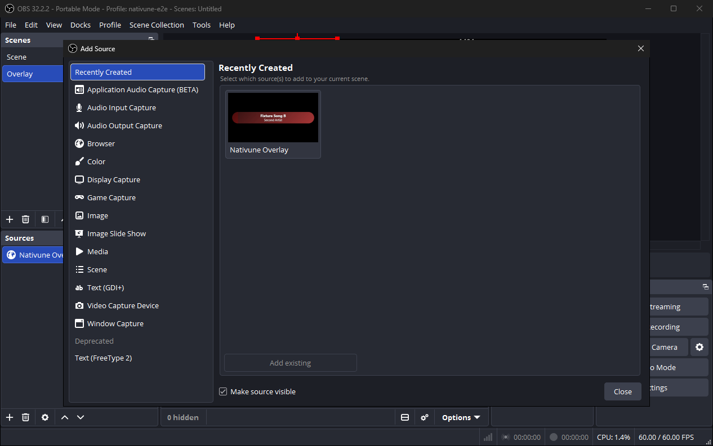
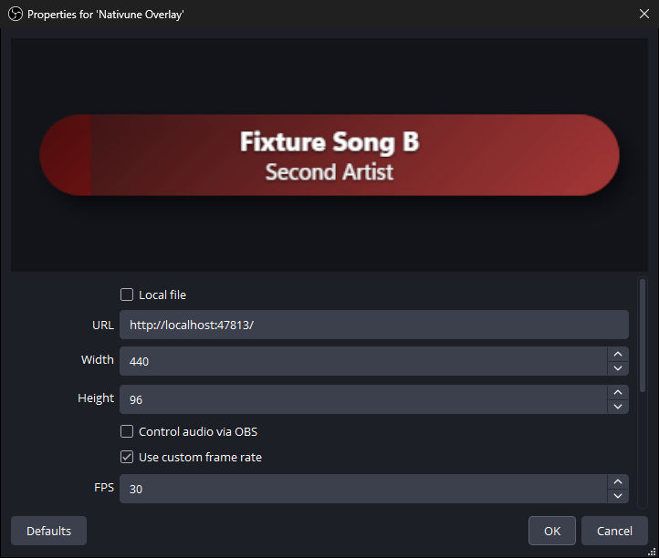
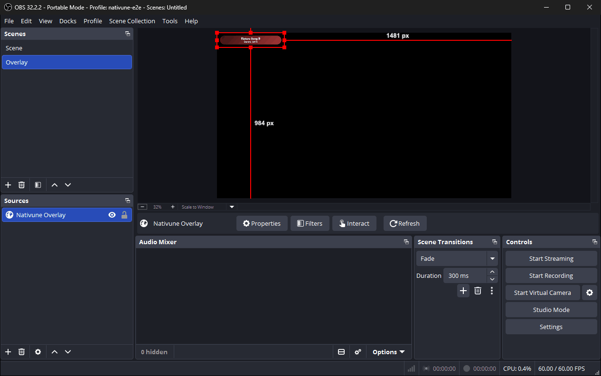

# OBS overlay

Nativune can show what you're playing as a small "now playing" bar in OBS Studio: the song's title, artist, artwork and a progress fill. You add it to OBS as a Browser source. It is optional and off by default.

## Turn it on

1. In Nativune, open **Settings › OBS**.
2. Tick **Enable OBS overlay**, then click **Save**.

While it is off, Nativune runs no overlay server and reads nothing for it, so it costs nothing.

The status line at the bottom of the page shows **Waiting for OBS** until OBS connects, then **Connected to 1 source** (or more).

## Add it to OBS

Click **Copy link** in Settings › OBS. It copies `http://localhost:47813/`. Then in OBS:

1. OBS › Sources › + › Browser.
2. URL = the link; Width 440; Height 96.
3. Tick "Shutdown source when not visible".
4. Tick "Use custom frame rate", 30.
5. Leave "Refresh browser when scene becomes active" off.
6. Use one source; add it to other scenes as a reference (Paste (Reference)), not a copy.
7. If OBS was opened first, click Refresh.

In OBS 32, the **+** under Sources opens an **Add Source** window: choose **Browser**, give it a name and confirm, and the properties window opens.

"Shutdown source when not visible" closes the overlay page a few seconds after its scene stops showing, so it doesn't keep running in the background. Using one source as a reference in every scene keeps a single connection to Nativune.

## When the song is paused

**Hide the overlay when paused** is on by default: the bar fades out while the song is paused and comes back when it plays.

If you turn it off, a paused song keeps the bar on screen, dimmed to 70 % and with the progress fill stopped where the song paused.

## Ads

Ads hide the overlay while they play. To reduce ads you can turn on Block ads in Settings › Privacy. YouTube may detect it, interrupt playback or warn your account. Restart required.

The **Open Block ads setting** button on the OBS page takes you to Settings › Privacy. Nativune never turns Block ads on for you; it stays off unless you tick it.

## Privacy

When on, apps on this PC can read the song title, artist, artwork link and playback time at http://localhost:47813/. Other PCs and websites cannot. OBS loads the artwork from YouTube's image servers.

- This works even when Discord status is off.
- Nothing else is shared: no account, history, album name or song link.
- Nothing is served while the setting is off.

## Troubleshooting

The status line in Settings › OBS tells you what is happening:

- **Off** — the overlay is turned off.
- **Turns on after Save** / **Turns off after Save** — you changed the setting; click **Save** to apply it.
- **Waiting for OBS** — the overlay is running but no OBS source is connected. Check that the source's URL is exactly `http://localhost:47813/`, that the source is in the scene you're showing, and click **Refresh** in its properties.
- **Connected to N sources** — working. If you see more than one source, use one source as a reference in each scene instead of copies (step 6).
- **Couldn't start: another app, or another Nativune, is using the overlay link.** — close the other Nativune or the app that uses port 47813, then turn **Enable OBS overlay** off and on again (Save each time), or restart Nativune.
- **Couldn't start: Windows blocked the overlay link.** — Windows refused the local address. Turn the setting off and on again, or restart Nativune.
- **Couldn't start the overlay.** — turn the setting off and on again, or restart Nativune.

**OBS was opened before Nativune** (or before you turned the overlay on): the source shows nothing because it loaded when the overlay wasn't running yet. Open the source's properties in OBS and click **Refresh**, once.

**The bar is empty or disappears:** it hides when nothing is playing, during ads, and while paused if **Hide the overlay when paused** is on.

**Limitations:** the overlay reads the song from YouTube Music's page, the same way Compact and Discord status do, so a change to the website can break it.
