# OBS overlay

Nativune can show what you're playing as a small "now playing" bar in OBS Studio: the song's title, artist, artwork and a progress fill. You add it to OBS as a Browser source. It is optional and off by default.

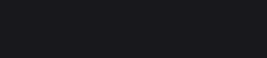

## Set it up, step by step

These screenshots were taken from a fresh OBS Studio 32.2.2 with an empty scene, playing a test song.

### In Nativune: turn it on and copy the link

1. Open the **More commands and settings** menu (the **⋯** button on the toolbar, or F10) and choose **Settings…**.

   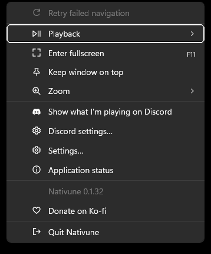

2. Select the **OBS** tab.

   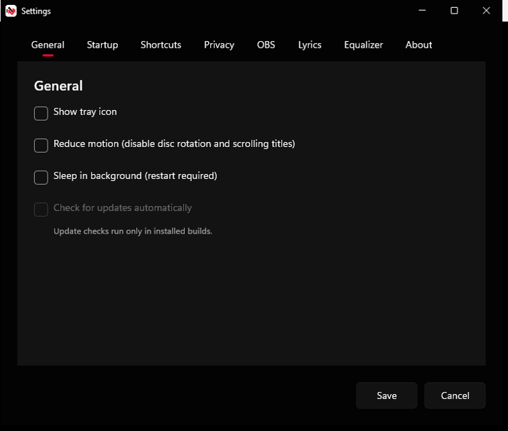

3. Read what the overlay shares (see [Privacy](#privacy)), then tick **Enable OBS overlay**.

   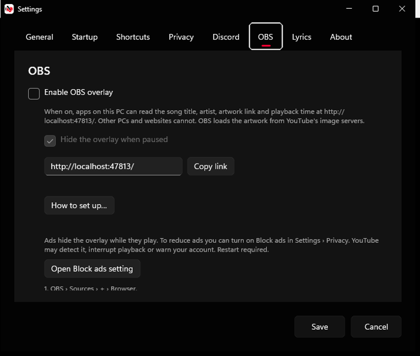

4. **Hide the overlay when paused** is ticked by default. Untick it if you want the bar to stay on screen, dimmed, while the song is paused.

   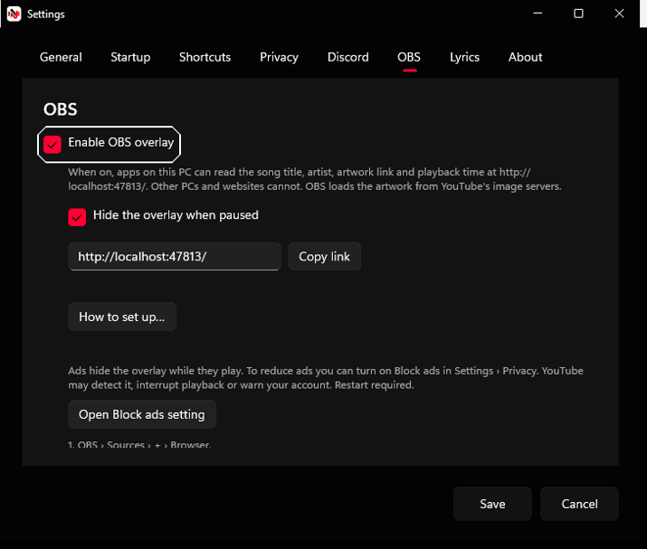

5. Click **Copy link**. It copies `http://localhost:47813/` and shows **Link copied.**

   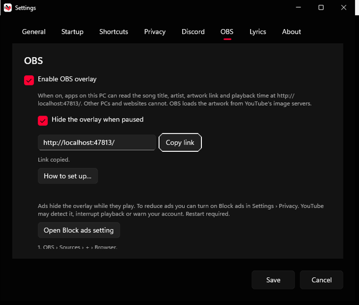

6. Click **Save**. Ticking the box alone doesn't turn the overlay on; until you save, the status line says **Turns on after Save**.

   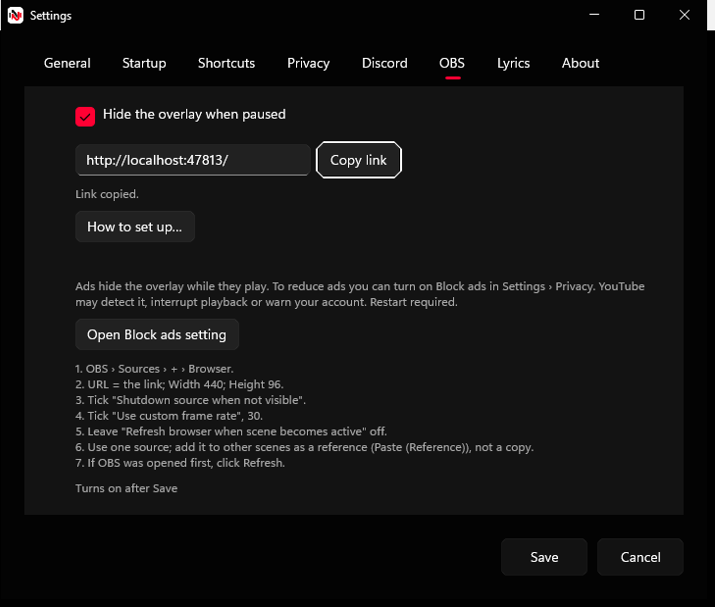

While the overlay is off, Nativune runs no overlay server and reads nothing for it, so it costs nothing.

### In OBS: add a Browser source

7. In OBS, click **+** at the bottom of the **Sources** dock.

   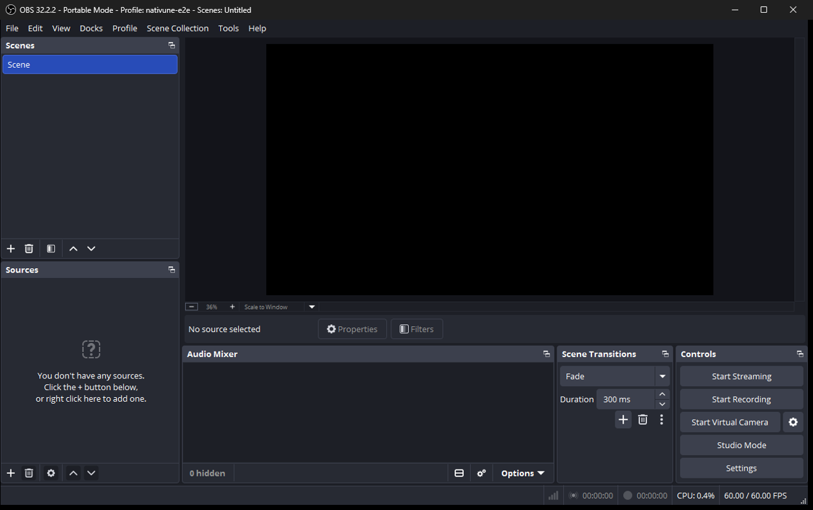

8. In the **Add Source** window, choose **Browser**.

   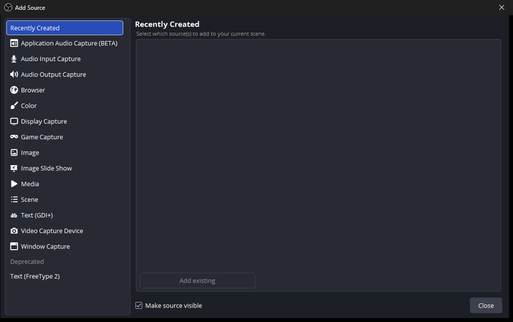

9. Leave **Make source visible** ticked and click **Add a new Browser**. OBS 32 creates a source named "Browser" and opens its properties right away. You rename it in step 15.

   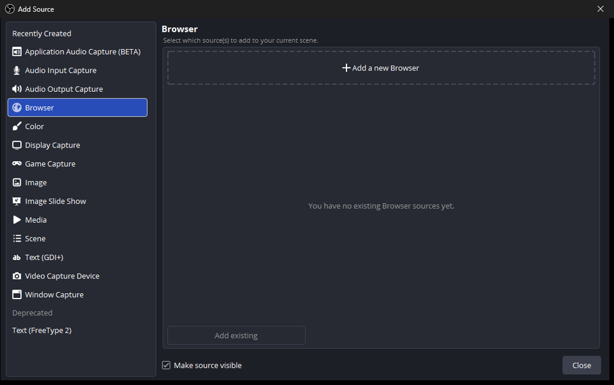

10. The **Properties for 'Browser'** window opens with OBS's default page.

    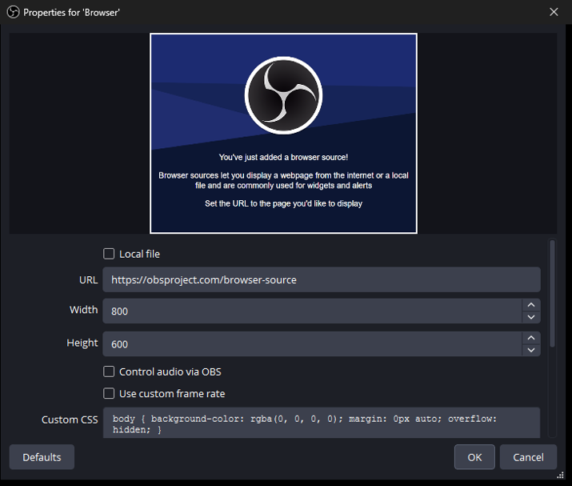

11. Replace **URL** by pasting the link (`http://localhost:47813/`), then set **Width** to 440 and **Height** to 96.

    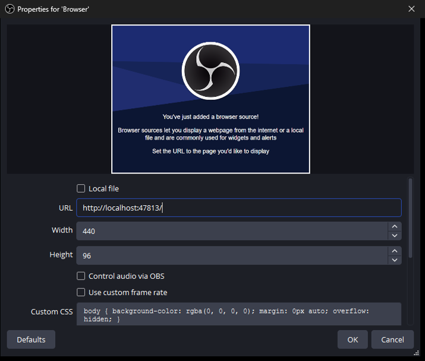

12. Tick **Use custom frame rate** and check that **FPS** is 30. Scroll down if needed.

    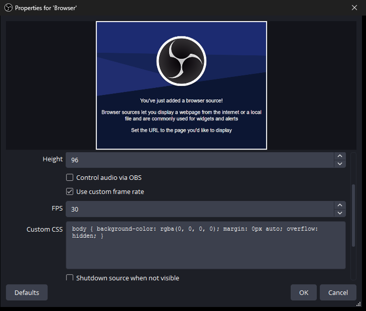

13. Tick **Shutdown source when not visible**, leave **Refresh browser when scene becomes active** unticked, and click **OK**.

    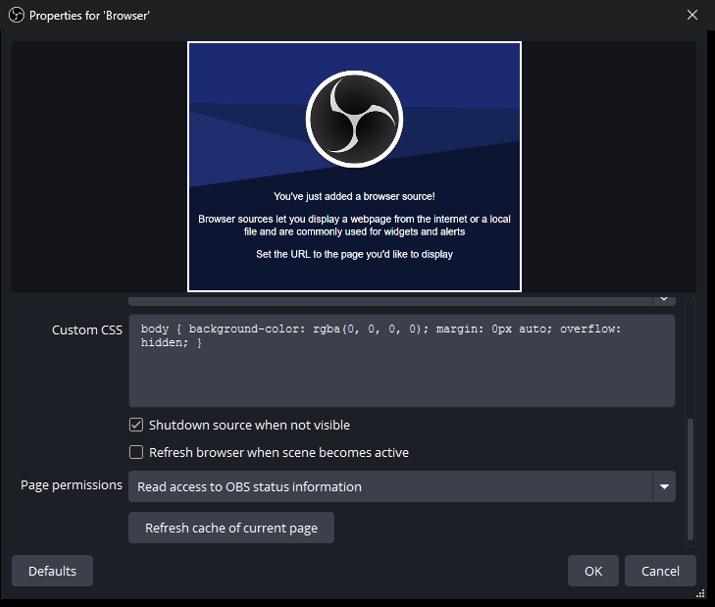

14. The now-playing bar appears at the top left of the OBS preview.

    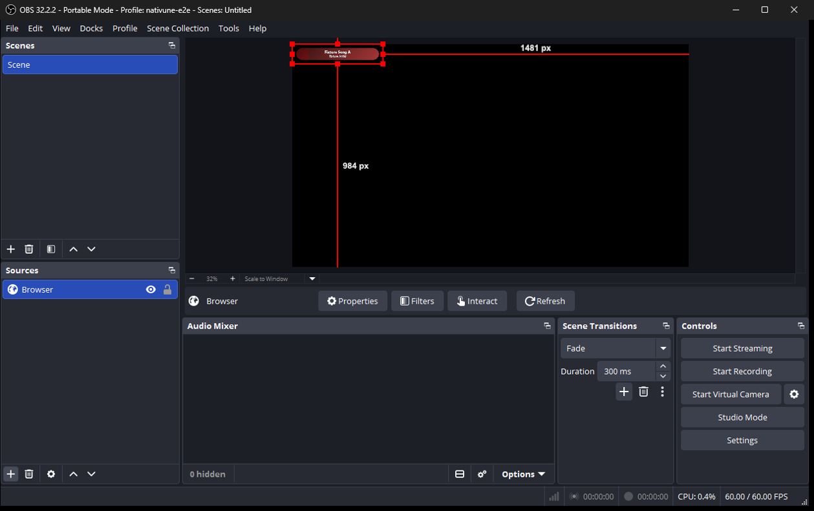

15. Optional: select **Browser** in Sources, press **F2** and name it `Nativune Overlay`.

    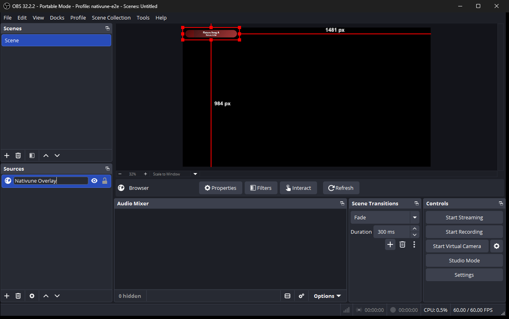

16. Press **Enter** to keep the name. Drag the bar in the preview to wherever you want it.

    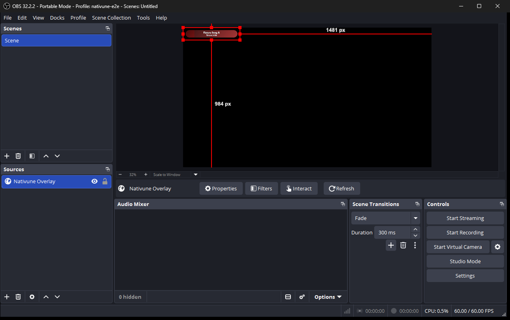

17. Click an empty part of the preview to deselect it. Done: the bar follows the song.

    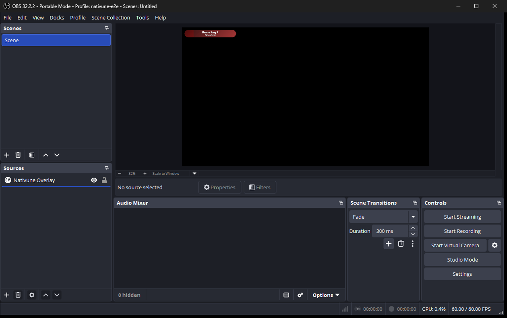

Back in Nativune, the status line in Settings › OBS changes from **Waiting for OBS** to **Connected to 1 source**.

**Using it in more than one scene:** copy the source, then use **Paste (Reference)** in the other scenes, not a plain paste. One source shared by reference keeps a single connection to Nativune.

**If OBS was open before you turned the overlay on,** open the source's properties and click **Refresh** once.

"Shutdown source when not visible" closes the overlay page a few seconds after its scene stops showing, so it doesn't keep running in the background.

## Turn it on and off from the toolbar

Once it's set up, you don't need Settings to turn the overlay on or off. The **OBS overlay** button on the left of the toolbar, after **Home**, switches it on or off and saves the change right away. When the overlay is on, a small red dot shows at the button's top-left corner, like a recording light. You can also use **More › Show the OBS overlay**. Hover over the button to see whether OBS is connected, or right-click it for **OBS overlay settings…**.

## Themes and saved looks

While the overlay is running, open **Settings › OBS** and click **Open Overlay designer…**. The native **Overlay designer** window lets you create and edit saved looks.

Choose one of eight themes in **Theme**: **Pill**, **Matte**, **Matte light**, **Standard**, **Classic**, **Simple**, **Album art** or **Card**. Each saved look has its own theme and options. You can keep up to 16 saved looks.

### Create, edit and use a look

1. Click **New look**, or select an existing look under **Saved looks**.
2. Enter a **Look name** and adjust the options. The live preview shows your draft in isolation: unsaved changes do not change your OBS sources. **Preview song source** lets you choose **Sample song** or **Current song**; the sample can show **Playing**, **Paused** or **No artwork**. **Preview background** lets you check the look against a checkerboard, dark, light or custom colour.
3. Click **Save look** to keep the changes and update sources using that look. **Revert changes** discards the draft and restores the saved look.
4. Click **Copy OBS link** and paste it into the URL of an OBS Browser source. Each saved look has its own link; the plain `http://localhost:47813/` link keeps the default overlay.
5. Set the source's width and height to the dimensions shown by the designer. Changing a look does not resize an existing OBS source.

**Duplicate** starts a copy of the selected saved look; click **Save look** to keep it. **Rename** selects the **Look name** field; enter the new name and click **Save look**. **Delete** asks for confirmation before removing the selected saved look.

### Colours, fonts and layout

Use **Colour mode** to choose **Automatic** or **Custom** colours. Where the theme supports them, **Choose text colour**, **Choose background colour** and **Choose accent colour** open colour pickers; you can also enter hexadecimal colours.

**Font family** lets you choose an installed font. If a saved font is unavailable, the designer shows **Font unavailable; using the theme's default** and uses the theme's default font.

You can also adjust text size, widget width, alignment, background opacity, text shadow, artwork, artist, progress, times, show and hide animations, and **When paused**. Only options supported by the selected theme are available.

### Per-look widget options

Each of these controls has a slider, a numeric field and a **Use theme default** button:

| Control | Range |
| --- | --- |
| **Background blur, pixels** | 0–32 px |
| **Played progress brightness, percent** | 0–200% |
| **Unplayed progress brightness, percent** | 0–100% |
| **Background brightness, percent** | 0–200% |

Background blur and background brightness affect only the song-art background in **Pill**, **Standard**, **Classic**, **Album art** and **Card**. They are inactive with **Custom** colours on Standard, Classic or Card, or when **Show artwork** is off on Album art. Their saved values are kept for when the song-art background is active again. Matte, Matte light and Simple have no song-art background.

Played and unplayed progress brightness are supported by all eight themes. Hiding progress makes the progress controls inactive, except that Pill still uses played progress brightness for its artwork.

## When the song is paused

For the default overlay link, **Hide the overlay when paused** is on by default: the bar fades out while the song is paused and comes back when it plays. Saved looks use their own **When paused** option in the designer: **Hide** or **Dim**.

If you turn it off, a paused song keeps the bar on screen, dimmed to 70 % and with the progress fill stopped where the song paused.

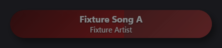

## Ads

Ads hide the overlay while they play. To reduce ads you can turn on Block ads in Settings › Privacy. YouTube may detect it, interrupt playback or warn your account. Restart required.

The **Open Block ads setting** button on the OBS page takes you to Settings › Privacy. Nativune never turns Block ads on for you; it stays off unless you tick it.

## Privacy

When on, apps on this PC can read the song title, artist, artwork and playback time at http://localhost:47813/. Other PCs and websites cannot. Nativune downloads the artwork from YouTube's image servers and passes it to OBS, so OBS itself never contacts YouTube for it.

- This works even when Discord status is off.
- Nothing else is shared: no account, history, album name, song link or YouTube video ID. The song is identified only by a random code that changes each time the overlay starts.
- Nothing is served while the setting is off.

## Troubleshooting

The status line in Settings › OBS tells you what is happening:

- **Off** — the overlay is turned off.
- **Turns on after Save** / **Turns off after Save** — you changed the setting; click **Save** to apply it.
- **Waiting for OBS** — the overlay is running but no OBS source is connected. Check that the source's URL is exactly `http://localhost:47813/`, that the source is in the scene you're showing, and click **Refresh** in its properties.
- **Connected to N sources** — working. If you see more than one source, use one source as a reference in each scene instead of copies (see **Using it in more than one scene** above).
- **Couldn't start: another app, or another Nativune, is using the overlay link.** — close the other Nativune or the app that uses port 47813, then turn **Enable OBS overlay** off and on again (Save each time), or restart Nativune.
- **Couldn't start: Windows blocked the overlay link.** — Windows refused the local address. Turn the setting off and on again, or restart Nativune.
- **Couldn't start the overlay.** — turn the setting off and on again, or restart Nativune.

**OBS was opened before Nativune** (or before you turned the overlay on): the source shows nothing because it loaded when the overlay wasn't running yet. Open the source's properties in OBS and click **Refresh**, once.

**The bar is empty or disappears:** it hides when nothing is playing, during ads, and while paused if **Hide the overlay when paused** is on.

**Limitations:** the overlay reads the song from YouTube Music's page, the same way Compact and Discord status do, so a change to the website can break it.
